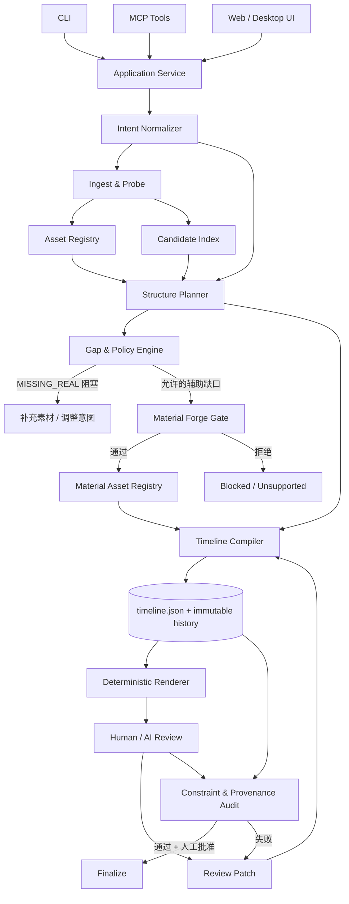

# CutKit 架构完善版

> 目标：把“素材摄取 → 候选镜头 → 组剪 → 渲染 → 评审 → 修改”的闭环，做成可重放、可审计、可逐步自动化的视频生产系统。
>
> 核心原则：**素材是证据，候选是建议，`timeline.json` 是唯一执行真相，渲染只是派生物，评审产生结构化补丁。**

---

## 1. 这套架构在做什么

CutKit 不是传统的非线性编辑器，而是一层围绕视频生产工作流的编排与治理系统。

一次典型工作流如下：

1. 用 `intent.json` 描述成片目标：时长、风格、必含内容、禁用内容、结构模板、随机种子和素材政策。
2. 将用户素材摄取进项目，完成探测、代理、缩略图、波形、转写、镜头切分和候选评分。
3. 候选库只推荐“可用片段”和入出点，不直接写入成片。
4. 根据叙事缺口决定使用实拍候选，或经过门禁后调用 Material Forge 生成合法的辅助素材。
5. 编译为不可歧义的 `timeline.json`，它描述每一段素材在时间线上的精确位置、裁切、变速、音频和转场。
6. 由确定性渲染器生成试片、联系表和最终成片。
7. 人或 AI 评审输出结构化意见；系统把意见转成 timeline patch，生成下一版本，而不是让模型直接改最终视频。
8. 反复修改，直到通过约束检查和人工审批。

简言之，它把视频创作拆成：

```text
意图 -> 证据 -> 候选 -> 计划 -> 渲染 -> 评价 -> 修订
```

其中只有“计划”是真相，其他环节都可以缓存、重建或替换。

---

## 2. 必须先明确的架构边界

### 2.1 三层状态不能混在一起

| 层 | 代表数据 | 性质 | 可否直接生成成片 |
|---|---|---|---|
| 素材层 | `SourceAsset` / `MaterialAsset` | 原始证据或带来源的合成物 | 否 |
| 候选层 | `CandidateShot` / `Gap` | 检索、评分与缺口建议 | 否 |
| 编辑层 | `Timeline` / `TimelineClip` | 唯一执行真相 | 是，且只能由它渲染 |

推荐把 `timeline.json` 理解为“编译产物 + 当前工作状态”，但它的历史版本必须不可变。

### 2.2 实拍与合成素材不是同权证据

原图中的“合成源与实拍同权进时间线”容易引起误读。准确原则应是：

- 它们可以进入同一个时间线模型；
- 它们不拥有相同的事实可信度；
- 合成素材必须携带 `provenance`、`synthetic: true`、生成参数和允许用途；
- 人物、地点、产品、事件、证言、证据等事实性角色只能由实拍或已验证素材承担；
- 合成素材只能补足明确允许的转场、图形、纹理、氛围或示意画面。

### 2.3 `MISSING_REAL` 是一等结果

缺真实素材时，系统首先产生：

```json
{
  "gapId": "gap_product_closeup_01",
  "kind": "MISSING_REAL",
  "requiredRole": "product_detail",
  "reason": "Timeline requires a truthful close-up of the actual product",
  "blocking": true
}
```

它不是“生成假 B-roll 的提示词”，而是需要用户补充素材、调整意图或显式降级叙事的阻塞项。

只有 gap 的策略明确允许辅助合成素材时，才进入 Material Forge。

---

## 3. 改进后的总体架构



### 3.1 控制面与数据面

- **控制面**：CLI、MCP、任务队列、状态机、日志和权限。
- **数据面**：素材、代理、候选、timeline、渲染件和评审记录。
- **执行面**：媒体探测、转写、镜头分析、渲染、合成素材生成。

CLI 和 MCP 只是两个同构入口，二者都调用同一组 Application Service。禁止在 CLI 与 MCP 中分别实现业务逻辑。

---

## 4. 项目生命周期

```text
DRAFT
  -> INGESTING
  -> INDEXED
  -> PLANNING
  -> MATERIAL_CHECK
  -> BUILDING
  -> RENDERING
  -> REVIEW_REQUIRED
  -> REVISING
  -> READY_FOR_APPROVAL
  -> APPROVED
  -> FINALIZED
```

任意执行状态都可以进入 `FAILED`；修复后回到原阶段。`FINALIZED` 项目只读，修改必须创建新 revision 或 fork。

建议状态保存在项目清单中，但每次迁移都写入 append-only 事件日志：

```json
{
  "event": "timeline.review_patch_applied",
  "projectId": "p_20260923",
  "fromRevision": 4,
  "toRevision": 5,
  "actor": "human:editor-01",
  "causeId": "review_0007",
  "at": "2026-09-23T10:15:30+08:00"
}
```

---

## 5. 核心数据契约

### 5.1 项目清单

```json
{
  "schemaVersion": 1,
  "projectId": "p_20260923_demo",
  "state": "REVIEW_REQUIRED",
  "timelineRevision": 5,
  "fps": 30,
  "resolution": [1920, 1080],
  "audioSampleRate": 48000,
  "currentTimeline": "history/timeline/0005.json",
  "lastRender": "renders/0005/preview.mp4",
  "contentHash": "sha256:..."
}
```

### 5.2 Intent

在原字段上补充硬约束、叙事要求、输出要求和素材政策：

```json
{
  "schemaVersion": 1,
  "targetDurationMs": 45000,
  "durationToleranceMs": 2000,
  "aspectRatio": "16:9",
  "style": {
    "tone": "documentary",
    "pacing": "measured",
    "visualTreatment": "natural"
  },
  "structureTemplate": "hook_body_end",
  "mustInclude": [
    { "id": "mi_01", "type": "shot_role", "value": "founder_interview", "blocking": true },
    { "id": "mi_02", "type": "fact", "value": "product_launch_date", "blocking": true }
  ],
  "avoid": [
    { "id": "av_01", "type": "tag", "value": "drone" },
    { "id": "av_02", "type": "synthetic_person", "value": "*" }
  ],
  "materialPolicy": {
    "minRealScreenTimePercent": 80,
    "maxProceduralScreenTimePercent": 25,
    "maxGeneratedScreenTimePercent": 10,
    "maxSyntheticTotalPercent": 30,
    "allowSyntheticAboveLimit": false
  },
  "seed": 731922
}
```

### 5.3 素材资产

```json
{
  "assetId": "src_interview_a_0001",
  "kind": "REAL",
  "uri": "sources/interview_a_0001.mov",
  "contentHash": "sha256:...",
  "media": {
    "durationMs": 382400,
    "fps": 29.97,
    "width": 3840,
    "height": 2160,
    "hasAudio": true
  },
  "roles": ["founder_interview", "testimony"],
  "rights": {
    "status": "cleared",
    "license": "internal",
    "consentRefs": ["consent_founder_001"]
  },
  "provenance": {
    "source": "camera_card_a",
    "capturedAt": "2026-09-18T09:32:11+08:00",
    "ingestedAt": "2026-09-23T08:10:02+08:00"
  }
}
```

### 5.4 合成素材

```json
{
  "assetId": "forge_transition_particles_0002",
  "kind": "SYNTHETIC_PROCEDURAL",
  "synthetic": true,
  "uri": "cache/forge/0002.webm",
  "allowedRoles": ["transition", "graphic_texture"],
  "prohibitedRoles": ["person", "place", "product", "evidence", "testimony"],
  "provenance": {
    "method": "procedural",
    "tool": "remotion",
    "recipeHash": "sha256:...",
    "parameters": { "seed": 731922, "durationMs": 800 },
    "createdAt": "2026-09-23T08:15:00+08:00"
  }
}
```

生成式素材还必须记录模型名、模型版本、prompt、负向 prompt、输入引用、随机种子和输出 hash。缺少任何一项即不可进入正式项目。

### 5.5 CandidateShot

候选是可解释的建议，不是编辑事实：

```json
{
  "candidateId": "cand_00841",
  "assetId": "src_broll_003",
  "sourceInMs": 12500,
  "sourceOutMs": 18400,
  "recommendedInMs": 13220,
  "recommendedOutMs": 17580,
  "roles": ["product_detail"],
  "tags": ["macro", "hands", "natural_light"],
  "scores": {
    "technical": 0.92,
    "relevance": 0.81,
    "continuity": 0.67,
    "safety": 1.0
  },
  "qualityFlags": ["camera_motion_at_15600"],
  "confidence": 0.84
}
```

评分必须拆维度，禁止只给一个不可解释的总分。

### 5.6 Timeline

```json
{
  "schemaVersion": 1,
  "revision": 5,
  "timelineHash": "sha256:...",
  "durationMs": 44870,
  "fps": 30,
  "tracks": [
    { "id": "V1", "kind": "video", "role": "primary" },
    { "id": "A1", "kind": "audio", "role": "dialogue" }
  ],
  "clips": [
    {
      "clipId": "clip_0001",
      "trackId": "V1",
      "assetId": "src_interview_a_0001",
      "sourceInMs": 5120,
      "sourceOutMs": 11850,
      "timelineStartMs": 0,
      "timelineEndMs": 6730,
      "speed": 1.0,
      "opacity": 1.0,
      "filters": [],
      "transitionIn": null,
      "transitionOut": { "type": "cut", "durationMs": 0 },
      "mustIncludeRefs": ["mi_01"]
    }
  ],
  "mix": {
    "gainDbByTrack": { "A1": 0.0 },
    "ducking": []
  },
  "constraintState": {
    "realPercent": 84.1,
    "syntheticProceduralPercent": 12.7,
    "syntheticGeneratedPercent": 3.2
  }
}
```

重要约束：

- 时间线范围必须连续、不重叠地表达输出，特殊画中画除外；
- 所有时间值必须是明确单位，推荐整数毫秒；
- 外部插件参数必须有 schema 版本；
- `timelineHash` 根据规范化 JSON 计算，不能直接对格式化文本计算；
- 当前 `timeline.json` 只是便捷入口，历史版本必须保存在 `history/timeline/`。

### 5.7 Review

评审意见不能只有 `too_slow / drop / keep` 这类自由标签，而要能转换为确定性补丁：

```json
{
  "reviewId": "review_0007",
  "revision": 5,
  "reviewer": "human:editor-01",
  "verdict": "REQUEST_CHANGES",
  "observations": [
    {
      "code": "TOO_SLOW",
      "severity": 2,
      "timelineRangeMs": [22100, 29700],
      "clipIds": ["clip_0008", "clip_0009"],
      "message": "信息密度下降，建议合并并缩短停留时间"
    },
    {
      "code": "MISSED_SHOT",
      "severity": 3,
      "requiredRoleId": "product_detail",
      "message": "缺少真实产品细节特写"
    }
  ],
  "suggestedPatch": [
    { "op": "trim", "clipId": "clip_0008", "newOutMs": 24900 },
    { "op": "remove", "clipId": "clip_0009" }
  ]
}
```

`apply_review` 会把 patch 应用为 timeline revision N+1，并保留 review 到新 revision 的映射。

---

## 6. 工具协议

CLI 与 MCP 共享以下动作。输入输出全部使用版本化 JSON。

| 动作 | 输入 | 输出 | 是否写 timeline |
|---|---|---|---|
| `cutkit.init` | 项目路径、Intent | 项目清单 | 否 |
| `cutkit.ingest` | 本地文件/目录/URL | Asset IDs | 否 |
| `cutkit.probe` | Asset IDs | 技术元数据 | 否 |
| `cutkit.analyze` | Asset IDs、分析配置 | 转写/场景/缩略图/波形索引 | 否 |
| `cutkit.build_candidates` | Asset IDs、Intent | Candidate IDs | 否 |
| `cutkit.plan` | Intent、候选、素材政策 | 结构计划、Gaps | 否 |
| `cutkit.forge_assess` | Gap、Material Policy | 允许/拒绝及原因 | 否 |
| `cutkit.forge_material` | 已批准 ForgeRequest | MaterialAsset | 否 |
| `cutkit.build_timeline` | 计划、候选、MaterialAssets | Timeline revision | 是 |
| `cutkit.audit` | Timeline revision | 硬约束/来源/比例报告 | 否 |
| `cutkit.render` | Timeline revision、RenderProfile | Render manifest | 否 |
| `cutkit.review` | Render、Timeline、Rubric | Review | 否 |
| `cutkit.apply_review` | Review、Timeline revision | 新 Timeline revision | 是 |
| `cutkit.approve` | Revision、审批者 | Approval record | 状态迁移 |
| `cutkit.finalize` | 已批准 revision | Final manifest + outputs | 锁定 |
| `cutkit.replay` | Project ID、目标 revision | 重放报告 | 否 |

### 6.1 统一返回结构

```json
{
  "ok": true,
  "operationId": "op_01J...",
  "projectId": "p_20260923_demo",
  "data": {},
  "warnings": [],
  "nextAllowedOperations": ["cutkit.render", "cutkit.review"]
}
```

失败必须返回稳定错误码，例如：

- `MISSING_REAL`
- `RIGHTS_UNCLEARED`
- `SYNTHETIC_POLICY_DENIED`
- `TIMELINE_CONSTRAINT_FAILED`
- `RENDER_CACHE_STALE`
- `REVISION_NOT_APPROVED`
- `FINALIZED_IMMUTABLE`

---

## 7. Material Forge 门禁

Material Forge 不是普通素材生成器，而是受限的补缺执行器。

### 7.1 两阶段门禁

**Gate 1：语义门禁**

回答三个问题：

1. 这个缺口是否必须由真实素材承担？
2. 合成内容是否会被误认为真实人物、地点、产品或证据？
3. Intent 和项目政策是否允许这一合成角色？

任一不确定即拒绝。

**Gate 2：制品门禁**

生成后检查：

- 是否符合时长、分辨率、帧率和 alpha/透明度要求；
- 是否产生不可接受的闪烁、伪影、文字错误或品牌畸变；
- 是否会与实拍主体发生误导性匹配；
- provenance 是否完整；
- 是否超过项目合成素材比例上限。

### 7.2 Forge-A / Forge-B

- `FORGE_A_PROCEDURAL`：Remotion、图形、粒子、遮罩、动态字幕、纹理、转场。默认优先。
- `FORGE_B_GENERATIVE`：图片/视频生成模型。默认关闭，只能用于非事实性辅助画面。

Forge-B 需要显式批准，且必须保留输入引用。人物、地点、产品、证据类内容永远禁止用 Forge-B 替代。

### 7.3 比例口径

原图中的比例缺少分母定义。建议按“有效屏幕占用时间”统计：

```text
realPercent = 实拍轨道有效显示时间 / 总有效显示时间
proceduralPercent = Forge-A 有效显示时间 / 总有效显示时间
generatedPercent = Forge-B 有效显示时间 / 总有效显示时间
```

- 全屏 clip 计 100%；
- 画中画按画面面积占比折算；
- 纯音频不计入画面比例；
- 黑场、字幕、Logo 条可单列，不与实拍叙事混算；
- 合成超过 30% 时不能静默继续，必须由项目所有者修改 policy 并写入审计事件。

---

## 8. 评审闭环

### 8.1 评审维度

1. **事实正确**：没有虚构人物、地点、产品、事件、证据或语义篡改。
2. **意图覆盖**：所有 `must_include` 均有时间线证据。
3. **结构完整**：Hook、主体、结尾或所选模板完整。
4. **节奏有效**：过慢、拖沓、跳切、信息密度和情绪曲线。
5. **视听质量**：构图、稳定、曝光、声音、响度、字幕、转场。
6. **连续性**：动作、视线、方向、色彩、声音和叙事逻辑。
7. **素材政策**：来源、权利、合成比例和禁止用途。

### 8.2 Review 与 Patch 分离

- Review 记录“哪里有什么问题”。
- Patch 记录“如何确定性修改”。
- 人可以直接改 patch。
- AI 只能建议 patch，不能绕过 audit 或 approval。
- 每个 patch 都必须声明 `baseRevision`；版本不匹配则拒绝应用。

### 8.3 最大轮数

保留最多 3 轮作为默认值，但不能简单失败。第 3 轮后进入 `READY_FOR_APPROVAL` 或 `BLOCKED`，并生成：

- 尚未解决问题；
- 已接受取舍；
- 需要补充素材；
- 需要修改 Intent；
- 需要人工裁决的冲突。

---

## 9. 确定性与可重放

同一个项目 revision 必须能重建同一结果。

需要固定：

- 规范化 timeline schema；
- 所有随机种子；
- FFmpeg/Remotion/模型版本；
- 字体与 ICC 色彩配置；
- 渲染 profile；
- 素材 content hash；
- 转写和分析模型版本；
- 生成式模型版本与参数。

推荐计算两把 hash：

```text
editHash   = hash(normalized timeline + asset hashes)
renderHash = hash(editHash + render profile + renderer version)
```

`renders/` 只是缓存。只要 renderHash 未变，可以直接复用；变了则精确重渲染受影响区段或整条时间线。

---

## 10. 工程目录建议

在原目录基础上加入不可变历史、审计和运行产物：

```text
project/
  project.json
  intent.json
  sources/
  cache/
    probes/
    proxies/
    thumbnails/
    waveforms/
    transcripts/
    scenes/
    renders/
    forge/
  candidates.json
  timeline.json                 # 指向当前 revision 的便捷副本
  history/
    timeline/
      0001.json
      0002.json
    events.jsonl
    approvals.jsonl
  gaps/
  forge/
    requests/
    manifests/
  reviews/
    0001.json
  patches/
    0001.json
  renders/
    0005/
      render-manifest.json
      preview.mp4
      contact-sheet.jpg
      audio.wav
  reports/
    audit-0005.json
    provenance-0005.html
  final/
    manifest.json
    final.mp4
```

写入规则：

- 原始 `sources/` 永不原地修改；
- `history/`、`reviews/`、`patches/`、`events.jsonl` 只追加；
- 所有 JSON 先写临时文件、校验成功后原子替换；
- 每个 revision 同时写 checksum；
- 删除采用 tombstone，不从审计历史中物理消失。

---

## 11. 可观测性与诊断

每次运行至少记录：

- operationId、projectId、revision；
- 输入 hash 与工具版本；
- 开始/结束时间、耗时、CPU/GPU/内存峰值；
- 缓存命中或重算原因；
- 硬约束检查结果；
- 人工或模型 actor；
- warning/error 稳定代码。

渲染后生成自动 QA 报告：

- 时长误差；
- 黑帧、静音、爆音、响度；
- 字幕安全区与可读性；
- 分辨率、帧率、色彩范围；
- 合成素材占比；
- 缺失 must_include；
- 可疑跳切或超短/超长镜头。

---

## 12. 安全、权利与真实性

必须在进入项目时完成：

- 素材来源登记；
- 使用许可/同意记录；
- 人脸、声音、品牌和未成年人风险识别；
- 合成内容水印或来源元数据策略；
- 事实性角色与娱乐性素材分权；
- 审批人身份和审批范围。

以下内容不能自动降级为合成替代：

- 身份、发言和证词；
- 真实地点和现场；
- 产品外观、性能和使用效果；
- 事故、医疗、法律、财务等证据；
- 新闻事实与历史事件。

---

## 13. MVP 实施顺序

### Phase 1：可重放的实拍组剪

- Intent schema；
- ingest/probe/proxy/thumbnail/waveform；
- CandidateShot 索引；
- timeline schema、audit 和原子历史；
- FFmpeg preview/contact/final 渲染；
- CLI + JSON API。

验收：同一 revision 两次运行得到相同 renderHash，缺失素材不会被悄悄替换。

### Phase 2：结构化评审闭环

- 人工时间线标记；
- Review schema；
- Patch 应用与 revision 检查；
- 三轮闭环报告；
- 自动 QA。

验收：每个评审问题都能定位到时间范围或 clipId，且能追踪到修改后的 revision。

### Phase 3：AI 组剪建议

- 多维候选评分；
- 叙事结构规划；
- must_include 覆盖证明；
- AI Review → 建议 Patch；
- 人工批准门禁。

验收：AI 不能绕过 policy、audit、approval；每次选择都可解释。

### Phase 4：Material Forge

- Forge-A 程序化素材；
- Gap 与两阶段 Gate；
- provenance manifest；
- 比例计算与阻塞；
- 可选 Forge-B，默认关闭。

验收：系统在缺真实镜头时优先返回 `MISSING_REAL`，只在政策明确允许时生成辅助素材。

---

## 14. 当前图中最值得优先修正的四点

1. **把“同权进时间线”改成“同模型接入、不同证据权限”。**
2. **把 Review 标签改成“结构化观察 + 确定性 Patch”。**
3. **把 `timeline.json` 的修改改成不可变 revision，并用事件日志追踪因果。**
4. **给实拍/Forge 比例定义统一分母、画中画折算规则和审批路径。**

完成这四点后，CutKit 就从“能串起剪辑步骤的流程图”，升级为“可以稳定实现、审计和扩展的生产架构”。
